# KI-RAG & KI-Parser-Video System - AI-Focused Architecture

## 1. Use Case Diagram - AI Services Focus

```mermaid
graph TB
    subgraph "Actors"
        Admin[👤 Admin User]
        Client[👤 Client User]
        AIAssist[🤖 AI Assistant]
   ## 6. AI Processing Flow - KI-RAG & KI-Pars## 7. KI-RAG Internal Architecturer-Videoend

    s## 8. KI-Parser-Video Internal Architecturebgraph "AI Core Services## 9. AI Query Flow - Smart Context Re## 10. Release Notes AI Workflow ## 11. AI Services Integration & Data Flow KI-Parser-Video Focusrieval
        subgraph "KI-RAG Service (Python)"
            UC1[Process Documents]
            UC2[Generate Embeddings]
            UC3[Vector Search]
            UC4[Text Extraction]
            UC5[Query Context]
        end
        
        subgraph "KI-Parser-Video Service (Python)"
            UC6[Parse Video Content]
            UC7[Extract Release Metadata]
            UC8[Version Detection]
            UC9[Generate Release Notes]
            UC10[Content Analysis]
        end
        
        subgraph "UI Operations"
            UC11[Upload Content]
            UC12[Search Knowledge Base]
            UC13[Manage Release Notes]
        end
    end

    %% User interactions with AI services
    Admin --> UC11
    Admin --> UC13
    Client --> UC11
    Client --> UC12
    AIAssist --> UC5
    AIAssist --> UC3

    %% AI service interactions
    UC11 -.-> UC1
    UC11 -.-> UC6
    UC1 -.-> UC2
    UC6 -.-> UC7
    UC7 -.-> UC8
    UC8 -.-> UC9
    UC12 -.-> UC3
    UC5 -.-> UC3
    UC9 -.-> UC2
```

## 5. System Architecture - AI Services Focus


## 3. Frontend Architecture - Vue 3 TypeScript Knowledge Base Interface


## 4. Frontend User Journey & Interaction Flow


## 5. AI Processing Flow - KI-RAG & KI-Parser-Video


## 6. KI-RAG Internal Architecture


## 7. KI-Parser-Video Internal Architecture


## 8. AI Query Flow - Smart Context Retrieval


## 9. Release Notes AI Workflow - KI-Parser-Video Focus


## 10. AI Services Integration & Data Flow


## 11. Multi-Tenant AI Architecture with Intelligent Isolation

```mermaid
graph TB
    subgraph "Tenant A - Isolated AI Context"
        UserA[👤 User A]
        KBA[📚 Knowledge Base A]
        RNA[📝 Release Notes A]
        RAGA[🤖 KI-RAG Instance A]
        PARSERA[🎥 KI-Parser-Video A]
    end
    
    subgraph "Tenant B - Isolated AI Context"
        UserB[👤 User B]
        KBB[📚 Knowledge Base B]
        RNB[📝 Release Notes B]
        RAGB[🤖 KI-RAG Instance B]
        PARSERB[🎥 KI-Parser-Video B]
    end
    
    subgraph "Shared UI & Gateway Layer"
        Vue[Vue 3 Frontend]
        NestJS[NestJS API Gateway]
        Auth[Authentication Layer]
    end
    
    subgraph "AI Services Layer - Python on Fly.io"
        subgraph "KI-RAG Service Cluster"
            RAGCore[RAG Core Engine]
            EmbeddingCluster[Embedding Service Cluster]
            SearchCluster[Search Engine Cluster]
        end
        
        subgraph "KI-Parser-Video Service Cluster"
            VideoCore[Video Parser Core]
            AIAnalysis[AI Analysis Cluster]
            ReleaseCore[Release Generator Core]
        end
    end
    
    subgraph "Intelligent Storage Isolation"
        VectorNS[Vector DB with Namespaces]
        RedisNS[Redis with Tenant Prefixes]
        MinIOBuckets[MinIO Tenant Buckets]
        PostgresRLS[Postgres with RLS]
    end

    %% User connections
    UserA --> Vue
    UserB --> Vue
    Vue --> Auth
    Auth --> NestJS
    
    %% Tenant routing with AI context
    NestJS -.->|Tenant A Context + AI Params| RAGCore
    NestJS -.->|Tenant B Context + AI Params| RAGCore
    NestJS -.->|Tenant A Video Context| VideoCore
    NestJS -.->|Tenant B Video Context| VideoCore
    
    %% AI service processing
    RAGCore --> EmbeddingCluster
    RAGCore --> SearchCluster
    VideoCore --> AIAnalysis
    VideoCore --> ReleaseCore
    
    %% Tenant-aware AI instances
    RAGCore -.->|Namespace A| RAGA
    RAGCore -.->|Namespace B| RAGB
    VideoCore -.->|Context A| PARSERA
    VideoCore -.->|Context B| PARSERB
    
    %% Isolated data connections
    RAGA --> KBA
    RAGB --> KBB
    PARSERA --> RNA
    PARSERB --> RNB
    
    %% Storage with isolation
    EmbeddingCluster --> VectorNS
    SearchCluster --> RedisNS
    NestJS --> MinIOBuckets
    NestJS --> PostgresRLS
```



## Summary: AI-Powered Knowledge & Release Notes System

This architecture centers around **three main layers**:

### **🎨 Vue 3 TypeScript Frontend**
- **Modern component architecture** with KnowledgeBaseView.vue and specialized upload popups
- **Intelligent file handling** supporting documents, videos, and release notes
- **Real-time UI updates** with Element Plus components and Tailwind CSS styling
- **Multi-language support** with Vue I18n and enterprise authentication via Zitadel

### **🤖 KI-RAG Service (Primary AI Engine)**
- **Advanced text processing** with semantic understanding
- **Neural embedding generation** for context-aware search
- **Intelligent query processing** with relevance ranking
- **Multi-format document support** (PDF, DOC, TXT, URLs)

### **🎥 KI-Parser-Video Service (Release Notes AI)**
- **AI-powered video content analysis** and transcript extraction
- **Intelligent version detection** and change analysis
- **Automated release notes generation** with smart formatting
- **Seamless integration** with KI-RAG for knowledge storage

### **🔧 Supporting Infrastructure**
- **NestJS API Gateway** for orchestration and authentication
- **Multi-tenant isolation** with intelligent context separation
- **Optimized storage** with Vector DB, Redis caching, and file storage

The system delivers enterprise-grade AI capabilities for knowledge management and automated release documentation, with the Vue.js frontend providing an intuitive interface for users to interact with the powerful Python AI services.
