# Knowledge Base System - Diagrams & Architecture

## 1. Use Case Diagram

## 2. System Architecture Diagram

## 3. Data Flow Diagram - File Upload Process

## 4. Component Relationship Diagram

## 5. Database Entity Relationship Diagram

## 6. State Management Flow

## 7. Release Notes Workflow

## 8. RAG Query Process

## 9. Multi-Tenant Data Isolation

## 10. File Type Processing Matrix

```mermaid
graph LR
    subgraph "Input Types"
        PDF[📄 PDF Files]
        DOC[📝 Word Docs]
        TXT[📋 Text Files]
        URL[🌐 Web URLs]
        VIDEO[🎥 Video Files]
        AUDIO[🎵 Audio Files]
    end
    
    subgraph "Processing Pipeline"
        Extract[Text Extraction]
        Chunk[Text Chunking]
        Embed[Create Embeddings]
        Store[Vector Storage]
    end
    
    subgraph "Storage Layers"
        MinIOStore[MinIO<br/>Original Files]
        VectorDB[Vector DB<br/>Embeddings]
        PostgresDB[PostgreSQL<br/>Metadata]
    end
    
    PDF --> Extract
    DOC --> Extract
    TXT --> Extract
    URL --> Extract
    VIDEO --> Extract
    AUDIO --> Extract
    
    Extract --> Chunk
    Chunk --> Embed
    Embed --> Store
    
    Store --> VectorDB
    Extract --> MinIOStore
    Embed --> PostgresDB
```

## 11. Knowledge Gap Detection Flow

This comprehensive set of diagrams illustrates the Knowledge Base system's architecture, data flows, user interactions, and integration points with the RAG service and Release Notes functionality. The system demonstrates a sophisticated multi-tenant architecture that supports both general knowledge management and specialized release note handling through a unified interface.
