# Knowledge Base Gaps - System Diagrams

This document contains three key diagrams for the Knowledge Base Gaps functionality:
1. Use Case Diagram
2. Sequence Diagram  
3. Class Diagram

## 1. Use Case Diagram - Knowledge Base Gaps System

```mermaid
flowchart TD
    %% Actors
    VoiceAssistant[🎤 Voice Assistant]
    EndUser[👤 End User]
    ClientAdmin[👤 Client Admin]
    SystemQueue[⚙️ System Queue]
    
    %% System Boundary
    subgraph KBGapsSystem["📚 Knowledge Base Gaps System"]
        
        %% Core Use Cases
        UC1[UC1: Detect Knowledge Gap<br/>from Failed Call]
        UC2[UC2: Create New Gap Entry]
        UC3[UC3: Find Existing Gap]
        UC4[UC4: Associate Call with Gap]
        UC5[UC5: Link Knowledge Sources]
        UC6[UC6: View Gap List]
        UC7[UC7: View Gap Details]
        UC8[UC8: Explore Related Calls]
        UC9[UC9: Access Knowledge Sources]
        UC10[UC10: Navigate to Insights]
        UC11[UC11: Paginate Gap Results]
        UC12[UC12: Filter by Gap Status]
        UC13[UC13: Mark Gap as Covered]
        UC14[UC14: Process Queue Jobs]
        UC15[UC15: Extract Source IDs<br/>from RAG Results]
        UC16[UC16: Validate Call Failure]
        UC17[UC17: Check KB Enablement]
        UC18[UC18: Set Tenant Context]
        
        %% Supporting Use Cases
        UC19[UC19: Open Document Links]
        UC20[UC20: Format Gap Display]
        UC21[UC21: Handle Pagination]
        UC22[UC22: Navigate Between Views]
    end
    
    %% Actor-Use Case Relationships
    VoiceAssistant --> UC1
    VoiceAssistant --> UC16
    EndUser --> UC6
    EndUser --> UC7
    EndUser --> UC8
    EndUser --> UC9
    EndUser --> UC10
    EndUser --> UC11
    EndUser --> UC19
    EndUser --> UC22
    ClientAdmin --> UC6
    ClientAdmin --> UC7
    ClientAdmin --> UC8
    ClientAdmin --> UC9
    ClientAdmin --> UC10
    ClientAdmin --> UC11
    ClientAdmin --> UC12
    ClientAdmin --> UC13
    ClientAdmin --> UC19
    ClientAdmin --> UC22
    SystemQueue --> UC14
    SystemQueue --> UC1
    SystemQueue --> UC2
    SystemQueue --> UC3
    SystemQueue --> UC4
    SystemQueue --> UC5
    SystemQueue --> UC15
    SystemQueue --> UC17
    SystemQueue --> UC18
    
    %% Include Relationships
    UC1 -.->|includes| UC16
    UC1 -.->|includes| UC17
    UC1 -.->|includes| UC18
    UC1 -.->|includes| UC3
    UC2 -.->|includes| UC18
    UC4 -.->|includes| UC3
    UC5 -.->|includes| UC15
    UC6 -.->|includes| UC20
    UC6 -.->|includes| UC21
    UC7 -.->|includes| UC8
    UC7 -.->|includes| UC9
    UC8 -.->|includes| UC22
    UC9 -.->|includes| UC19
    UC10 -.->|includes| UC22
    UC11 -.->|includes| UC21
    UC14 -.->|includes| UC1
    
    %% Extend Relationships
    UC2 -.->|extends| UC1
    UC13 -.->|extends| UC7
    UC12 -.->|extends| UC6
    
    %% Styling
    classDef actor fill:#e1f5fe,stroke:#01579b,stroke-width:2px
    classDef usecase fill:#f3e5f5,stroke:#4a148c,stroke-width:1px
    classDef system fill:#e8f5e8,stroke:#2e7d32,stroke-width:2px
    
    class VoiceAssistant,EndUser,ClientAdmin,SystemQueue actor
    class UC1,UC2,UC3,UC4,UC5,UC6,UC7,UC8,UC9,UC10,UC11,UC12,UC13,UC14,UC15,UC16,UC17,UC18,UC19,UC20,UC21,UC22 usecase
    class KBGapsSystem system
```



## 2. Sequence Diagram - Knowledge Base Gap Processing Flow

```mermaid
sequenceDiagram
    participant VA as 🎤 Voice Assistant
    participant EU as 👤 End User
    participant CA as 👤 Client Admin
    participant Frontend as 🖥️ Vue Frontend
    participant Controller as 🎯 KB Gap Controller
    participant Service as ⚙️ KB Gap Service
    participant Queue as 📋 PG Boss Queue
    participant WebhookSvc as 🔗 Webhook Service
    participant KBSvc as 📚 Knowledge Base Service
    participant DB as 🗄️ PostgreSQL DB
    
    Note over VA, DB: Gap Detection Flow (Failed Call Processing)
    
    VA->>Queue: Call failed with reason
    activate Queue
    Queue->>Service: Process PERSIST_KNOWLEDGE_BASE_GAP_Q
    activate Service
    
    Service->>Service: Extract webhook actions
    Service->>Service: Check call success status
    alt Call status is Failure/Unclear
        Service->>Service: Validate KB enabled for assistant
        alt KB is enabled
            Service->>Service: Set tenant context (subAccountId)
            Service->>DB: Find existing gap by description
            alt Gap exists
                Service->>Service: Use existing gap
            else Gap doesn't exist
                Service->>DB: Create new KB gap entity
                Service->>DB: Save new gap
                Note right of Service: Gap status = NEW
            end
            
            Service->>Service: Extract source IDs from RAG results
            Service->>WebhookSvc: Assign webhook to gap
            Service->>KBSvc: Get knowledge bases by source IDs
            Service->>Service: Link knowledge bases to gap
            Service->>DB: Save updated gap with relations
        end
    end
    deactivate Service
    deactivate Queue
    
    Note over EU, DB: Client Admin Gap Management Flow
    
    CA->>Frontend: Navigate to Knowledge Base view
    activate Frontend
    Frontend->>Frontend: Switch to "KB Gaps" tab
    Frontend->>Controller: GET /kb-gap?limit=10&offset=0
    activate Controller
    Controller->>Service: getKnowledgeBaseGaps(limit, offset)
    activate Service
    Service->>DB: findAndCount with relations
    DB-->>Service: Return gaps data + count
    Service-->>Controller: Return paginated response
    deactivate Service
    Controller-->>Frontend: JSON response with gaps
    deactivate Controller
    
    Frontend->>Frontend: Render gaps table
    Frontend->>Frontend: Display status tags (NEW/COVERED)
    
    Note over EU, DB: End User Gap Exploration Flow
    
    EU->>Frontend: Click on gap row
    Frontend->>Frontend: Navigate to insights view
    Frontend->>Frontend: Pass gap description as route param
    
    EU->>Frontend: Click on "X calls" link
    Frontend->>Frontend: Open calls popover
    loop For each related call
        Frontend->>Frontend: Display call details
        EU->>Frontend: Click on call
        Frontend->>Frontend: Navigate to calls view
    end
    
    EU->>Frontend: Click on "X sources" link  
    Frontend->>Frontend: Open sources popover
    loop For each knowledge base source
        Frontend->>Frontend: Display source description
        EU->>Frontend: Click on source
        alt Source is LINK type
            Frontend->>Frontend: Open URL in new tab
        else Source is FILE type
            Frontend->>KBSvc: Get signed URL for file
            KBSvc-->>Frontend: Return signed URL
            Frontend->>Frontend: Open file in new tab
        end
    end
    
    Note over CA, DB: Gap Status Management
    
    CA->>Frontend: Update gap status to COVERED
    Frontend->>Service: Update gap entity
    Service->>DB: Set status = COVERED, coveredDate = now()
    DB-->>Service: Confirm update
    Service-->>Frontend: Success response
    Frontend->>Frontend: Refresh gap list
    
    deactivate Frontend
```



## 3. Class Diagram - Knowledge Base Gaps Architecture

```mermaid
classDiagram
    %% Backend Core Classes
    class KbGapEntity {
        +string id
        +string description
        +KbGapStatusEnum status
        +Date coveredDate?
        +Date updated
        +Date created
        +string subAccountId
        +KnowledgeBaseEntity[] knowledgeBases
        +WebhookEntity[] webhooks
    }
    
    class KbGapStatusEnum {
        <<enumeration>>
        NEW
        COVERED
    }
    
    class KbGapController {
        -KbGapService kbGapService
        +getKnowledgeBaseGaps(limit: number, offset: number)
    }
    
    class KbGapService {
        -TenantRepository~KbGapEntity~ kbGapEntityTenantRepository
        -KnowledgeBaseService knowledgeBaseService
        -WebhookService webhookService
        -ClsService cls
        -Logger logger
        +getKnowledgeBaseGaps(limit: number, offset: number)
        +addKnowledgeBaseToKbGap(kbGap: KbGapEntity, sourceIds?: string[])
        +persistKnowledgeBaseGaps(job: Job)
    }
    
    class KbGapModule {
        +imports: Module[]
        +controllers: KbGapController[]
        +providers: KbGapService[]
        +exports: KbGapService[]
    }
    
    %% Related Backend Classes
    class KnowledgeBaseEntity {
        +string id
        +string description
        +KnowledgeBaseType type
        +string storeId
        +string sourceId
        +string fileName
        +string linkUrl
        +boolean isReleaseNote
        +Date created
        +string subAccountId
        +KbGapEntity[] kbGaps
    }
    
    class WebhookEntity {
        +number id
        +string callId
        +string subCallingReason
        +string subAccountId
        +string assistantId
        +object resultJSON
        +KbGapEntity kbGap
    }
    
    class BaseEntity {
        +string subAccountId
    }
    
    %% Frontend Core Classes
    class KnowledgeBaseGapTable {
        -loading: Ref~boolean~
        -kbGapData: Ref~KbGapData~
        -PAGE_SIZE: number
        +fetchKnowledgeBaseTable(): Promise~void~
        +goToInsights(data: IKnowledgeBaseGap): void
        +openSignedDocument(data: IKnowledgeBase): Promise~void~
        +tagAttributes(status: KbGapStatus): string
    }
    
    class KnowledgeBaseView {
        -isMounted: Ref~boolean~
        -activeTab: Ref~string~
        -knowledgeBaseTableRef: TemplateRef
        -releaseNoteTableRef: TemplateRef
        +openUploadKnowledgeBasePopup(type: KnowledgeBaseType): void
    }
    
    class KnowledgeBaseService {
        +fetchKnowledgeBaseGaps(limit: number, offset: number): Promise~KnowledgeBaseGapResponse~
        +fetchKnowledgeBase(id: string): Promise~IKnowledgeBase~
        +fetchKnowledgeBaseFile(storeId: string, fileName: string): Promise~SignedUrlResponse~
    }
    
    %% Frontend Models
    class IKnowledgeBaseGap {
        +string id
        +KbGapStatus status
        +string description
        +string coveredDate
        +string updated
        +string created
        +IWebhook[] webhooks
        +IKnowledgeBase[] knowledgeBases
    }
    
    class IKnowledgeBase {
        +string id
        +string description
        +KnowledgeBaseType type
        +string storeId
        +string fileName
        +string linkUrl
        +Date created
    }
    
    class IWebhook {
        +number id
        +string callId
        +string phoneNumber
        +object resultJSON
    }
    
    class KbGapStatus {
        <<enumeration>>
        NEW
        COVERED
    }
    
    class KnowledgeBaseGapResponse {
        +IKnowledgeBaseGap[] data
        +IPagination pagination
    }
    
    %% Infrastructure Classes
    class TenantRepository~T~ {
        +findAndCount(options: FindManyOptions): Promise~[T[], number]~
        +findOne(options: FindOneOptions): Promise~T~
        +create(entityLike: DeepPartial~T~): T
        +save(entity: T): Promise~T~
    }
    
    class ProcessQueue {
        <<decorator>>
        +queueName: string
    }
    
    class Job~T~ {
        +data: T
        +id: string
    }
    
    %% Relationships
    KbGapEntity ||--o{ KnowledgeBaseEntity : "many-to-many"
    KbGapEntity ||--o{ WebhookEntity : "one-to-many"
    KbGapEntity --> KbGapStatusEnum : "uses"
    KbGapEntity --|> BaseEntity : "extends"
    KnowledgeBaseEntity --|> BaseEntity : "extends"
    
    KbGapController --> KbGapService : "depends on"
    KbGapService --> TenantRepository : "uses"
    KbGapService --> KnowledgeBaseService : "depends on"
    KbGapService --> WebhookService : "depends on"
    KbGapService --> ProcessQueue : "uses"
    
    KbGapModule --> KbGapController : "declares"
    KbGapModule --> KbGapService : "declares"
    
    KnowledgeBaseGapTable --> KnowledgeBaseService : "uses"
    KnowledgeBaseGapTable --> IKnowledgeBaseGap : "displays"
    KnowledgeBaseView --> KnowledgeBaseGapTable : "contains"
    
    IKnowledgeBaseGap --> IWebhook : "contains"
    IKnowledgeBaseGap --> IKnowledgeBase : "contains"
    IKnowledgeBaseGap --> KbGapStatus : "uses"
    
    KnowledgeBaseGapResponse --> IKnowledgeBaseGap : "contains"
    
    %% Styling
    classDef entity fill:#e3f2fd,stroke:#1976d2,stroke-width:2px
    classDef service fill:#f3e5f5,stroke:#7b1fa2,stroke-width:2px
    classDef controller fill:#e8f5e8,stroke:#388e3c,stroke-width:2px
    classDef frontend fill:#fff3e0,stroke:#f57c00,stroke-width:2px
    classDef model fill:#fce4ec,stroke:#c2185b,stroke-width:2px
    classDef enum fill:#f1f8e9,stroke:#689f38,stroke-width:2px
    
    class KbGapEntity,KnowledgeBaseEntity,WebhookEntity,BaseEntity entity
    class KbGapService,KnowledgeBaseService,WebhookService service
    class KbGapController controller
    class KnowledgeBaseGapTable,KnowledgeBaseView,KnowledgeBaseService frontend
    class IKnowledgeBaseGap,IKnowledgeBase,IWebhook,KnowledgeBaseGapResponse model
    class KbGapStatusEnum,KbGapStatus enum
```

## Summary

These diagrams provide a comprehensive view of the Knowledge Base Gaps functionality:

### Use Case Diagram
- Shows all actors (Voice Assistant, End User, Client Admin, System Queue)
- Identifies 22 core use cases covering gap detection, management, and user interactions
- Illustrates include/extend relationships between use cases

### Sequence Diagram
- Details three main flows: Gap Detection, Client Admin Management, and End User Exploration
- Shows interaction between frontend Vue components, NestJS backend, and database
- Covers the complete lifecycle from failed call detection to gap visualization

### Class Diagram
- Maps the complete architecture from backend entities to frontend components
- Shows relationships between 20+ classes including entities, services, controllers, and models
- Illustrates the multi-tenant structure and database relationships

The Knowledge Base Gaps system automatically detects when voice assistant calls fail due to missing knowledge, creates gap entries, associates them with related calls and knowledge sources, and provides a user-friendly interface for exploring and managing these gaps.
